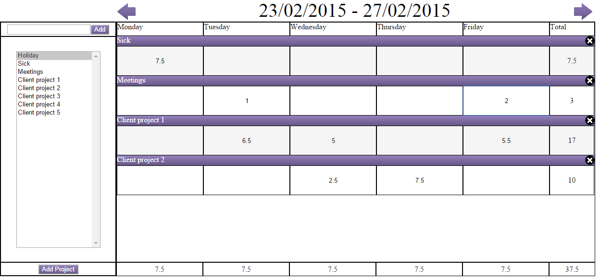
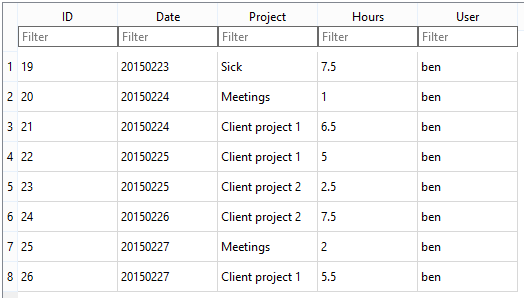

Time Sheet
========

This is a time sheet application, saving data to a web server which can have multiple users. It uses a SQL database (sqlite) on the server, so it can be easily queried using the SQL language, for example the total hours spent on a project.

* First time using flexbox for large parts of the layout.
* Via the sidebar you can add in your own projects and you can also delete projects using the button in the top-right of the project row.

